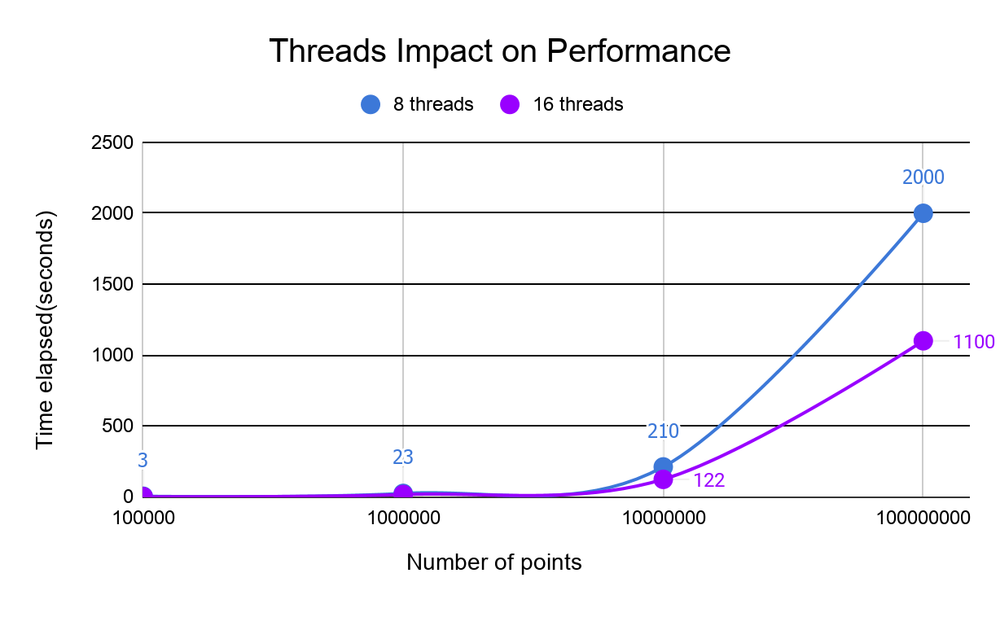

<link rel="stylesheet" type="text/css" media="all" href="Style/style.css" />
# Plotting with C++
<h3 class="heading3">Abstract</h3>
<h4 class="heading4">In today’s society, the tech industry is mostly dependent on a visual basis. The purpose of data visualisation applications(for students) could be reduced to 2 main objectives:
 * to support students in assimilating as much of the previously established theoretical knowledge as possible, according to their needs, interests and abilities
 * to develop students' understanding of the methods by which this knowledge has been acquired and verify it’s authenticity.</h4>
 <br>

 ## Introduction

In this project, we wanted to solve the problem of plotting a big set of data in order to better understand theoretical knowledge in the function plotting field. We study the nature of data plotting in C++ regarding its pros and cons(limitations).
The scope of the app is to generate graphs for various functions and to observe the steps taken by the algorithm in order to obtain the correct plotting.
Using C++(one of the fastest and most memory efficient languages) and Qt(a C++ cross-platform framework for GUI - Graphical User Interface), we developed an app that puts into use most of the modern features offered by C++(especially C++11).


## Technology used

* Qt and QCustomPlot.

* CmathParser.

One of the main problems encountered during development was using user-input functions, that is why we prioritised adding a fairly robust mathematics parsing engine written in C++/C. We found CmathParser<sup>[[1]](https://github.com/NTDLS/CMathParser)</sup> and we liked how it satisfies our app’s needs on the user interaction side.

Although it is fairly light  weight, CMathParser can interpret a various list of mathematical functions and operations and its performance is convenient in relation to the advantages that this engine brings. 
Because of this parser, the mathematical functions used need to follow a specific syntax(for example, √x is SQRT(x)). This is why we found it useful to read our functions from a file. We opted for reading from an XML(Extended Markup Language) file because we can use the tags in our advantage and clearly define every function and every parameter for that function.

This is an example for a XML file accepted by the app:

```xml
<?xml version="1.0"?>

<function>
	<Xn>SQRT(n)/(1+SQRT(n))</Xn>
	<Yn>SIN(n)/SQRT(1+n)</Yn>
	<FnX>(((XN)-(XN-1))*X+b*(XN-1)-a*(XN))/(b-a)</FnX>
	<FnY>((YN)-(YN-1)-(DN)*((M)-m))*X/(b-a)+(DN)*Y+(b*(YN-1)-a*(YN)-(DN)*(b*m-a*(M)))/(b-a)</FnY>
	<a>0</a>
	<b>1</b>
	<m>0</m>
	<M>0</M>
	<dn>0.4</dn>
</function>
```

QCustomPlot<sup>[[2]](https://www.qcustomplot.com/)</sup> is a Qt C++ widget for plotting and data visualization. It has no further dependencies and is well documented. This plotting library focuses on making good looking, publication quality 2D plots, graphs and charts, as well as offering high performance for real time data visualization applications.


## Technical Notes on Performance

Our target regarding the app’s performance focused around optimising the algorithm in a way that it brings up the graphs as soon as possible. To increase the performance, we used multithreading: we use all the available threads on the CPU and developed the algorithm in a way that favours concurrency. The algorithm finds out how many threads are available and uses them(for a CPU with 4 threads, the algorithm will use a maximum of 4 threads on max load) although it is possible to start any number of threads(the OS scheduler will put them in a priority queue). A program that starts 100 threads for 100 tasks on a 4 threaded CPU will be less performant than the same program that splits those 100 tasks in a way that the CPU takes 4 tasks at a time.

This is a threading code snippet that spawns as many threads as available to generate points:  

```cpp
int numberThread;

if (std::thread::hardware_concurrency() > 0) 
    numberThread = std::thread::hardware_concurrency();
else 
    numberThread = 4;

auto spawnThreads = [&]() 
{
    std::vector<std::thread> threads;
    for (int i = 1; i < numberThread; i++) 
    {
        threads.push_back(std::thread(generate, 0, numberPoint / numberThread,                                               
            "..//.//QtExample\\Step1\\file" + std::to_string(i) + ".txt"));
    }
    threads.push_back(std::thread(generate, 0, numberPoint - numberPoint / numberThread *   
    (numberThread - 1), "..//.//QtExample\\Step1\\file" + std::to_string(numberThread) + ".txt"));

    for (auto& th : threads) 
    {
        th.join();
    }
};
```



## Limitations


The only known limit of the app is the time required to generate and plot the points when they are hundreds of thousands or even more.
The next examples were run on a i7-7700HQ with 8 threads. RAM memory isn’t really relevant because the algorithm is very CPU heavy.  
For Step 1, generation and plotting for 100 000 points is made in approximately 2-3 seconds, and for every p*100 000(p is a signed integer), the time will be approximately p*x, where x ∊ [2,3].
For Step 2 things are a little bit more complicated. At a low level, the time for generating and plotting points will be the same as for Step 1. 

The difference occurs in the number of points Step 2 generates for parameters k, n, p which represent*:

The set K is considered finite (with k elements), and the following sets will be generated:  

K<sub>0</sub> = K
<br>
K<sub>1</sub> = f<sub>1</sub>
        (K<sub>0</sub>) ∪ 
     f<sub>2</sub>
        (K<sub>0</sub>)  ∪ …  ∪ 
    f<sub>n</sub>
        (K<sub>0</sub>)
<br>
K<sub>2</sub> = f<sub>1</sub>
        (K<sub>1</sub>) ∪ 
    f<sub>2</sub>
        (K<sub>1</sub>)  ∪ …  ∪ 
    f<sub>n</sub>
        (K<sub>1</sub>)
<br>
. . . 
<br>
K<sub>p</sub> = f<sub>1</sub>
        (K<sub>p-1</sub>) ∪ 
    f<sub>2</sub>
        (K<sub>p-1</sub>) ∪ … ∪ 
    f<sub>n</sub>
        (K<sub>p-1</sub>)
        
It can be seen above what is the evolution of the number of points that will be generated for each set K. 


## Conclusion

In conclusion, this app is a useful tool for plotting functions made in C++.  It truly shows the capabilities of this programming language and it pushes it to the maximum using threading and modern programming techniques.  


## Authors:

[Ionuț-Alin Dinu](https://github.com/Dinu-Alin) | 
[Adrian Călăvie](https://github.com/adriancalavie) |
[Florin Arhip](https://github.com/Florin9925)
